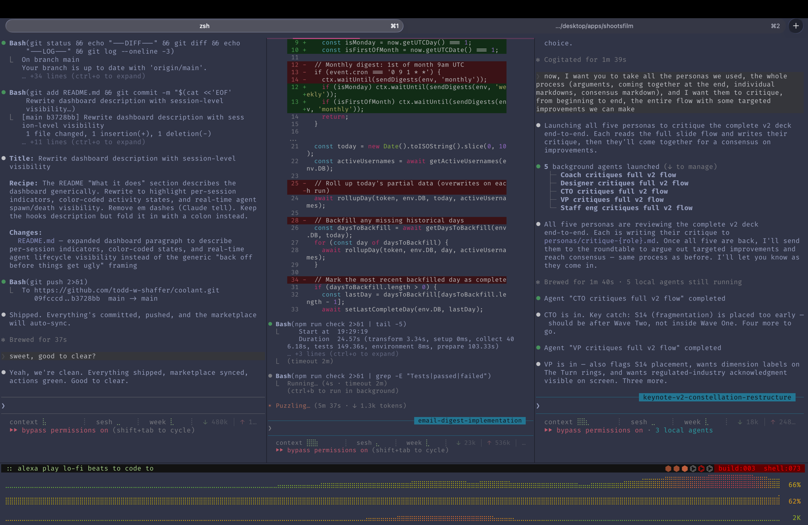
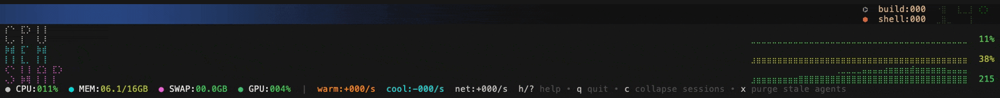
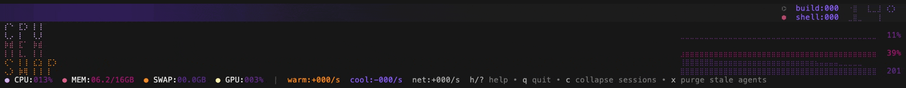
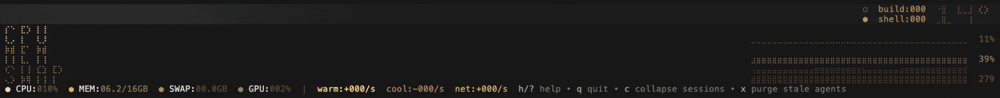
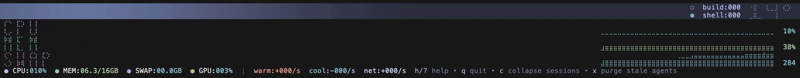

# coolant

A resource management layer for Claude Code -- prevents machines from melting when parallel agents run unthrottled.



## What it does

Run five Claude Code agents in parallel and your machine will try to compile, test, and lint everything at once. CPU pins, memory fills, the compressor spikes, and your whole system locks up. Coolant stops that.

The **dashboard** gives you a real-time read on system pressure. Each Claude Code session gets its own diamond, color-coded by escalation phase: idle (gray), language runtime spinning up (yellow), build tools running (orange), or full shell explosion (red, 30+ processes). Active subagents show as breathing hexagons on the headline bar. Spawn and death rates scroll through the display so you can see churn, not just snapshots. You see the state of your machine at a glance, not after the freeze. The **hooks** handle the rest: always capping concurrent test runners, and — when you opt in with `/coolant` — suppressing build tools entirely during parallel work. You get the throughput of parallel agents without the meltdown.

## Quick start

```bash
# Add the marketplace (one time)
claude plugin marketplace add todd-w-shaffer/marketplace

# Install the plugin
claude plugin install coolant@todd-w-shaffer

# Install the dashboard (macOS only)
curl -fsSL https://raw.githubusercontent.com/todd-w-shaffer/coolant/main/install.sh | bash

# See it in action
thermo --demo
```









## The dashboard

A single bottom-strip panel designed for a tmux split alongside your Claude Code session. Glance down, know the state.

- **Am I about to lock up?** -- CPU, MEM, and SWAP sparklines with severity coloring. Green is fine, yellow means watch it, red means act now.
- **Which session is the problem?** -- Each diamond is a Claude Code session. Color tracks the compilation dance: idle (gray), language spinning up (yellow), build tools running (orange), shell explosion (red, 30+ processes).
- **How many agents are running?** -- Breathing hexagons on the headline, one per active subagent. Pulsing means alive.
- **What's eating resources?** -- Live process counts by category (`build:003 shell:087`). Runtime labels (`node`, `go`, `rust`) appear when those processes are active and disappear when they're not.
- **System vitals** -- CPU/MEM/SWAP/GPU gauges, spawn/death rates, network connectivity.

Keyboard shortcuts: `h` help overlay, `q` quit.

## Hooks

Five agents each running `vitest`, `tsc`, and `eslint` means 15 build processes fighting for the same cores. Coolant's hooks prevent that automatically:

- **Test runners are always capped.** Each agent gets a fair share of your CPU — one agent runs freely, five agents each get throttled proportionally. No configuration needed.
- **Build tools are suppressed on demand.** Run `/coolant` and type checkers, linters, and compilers are blocked during parallel work, then restored when agents finish.
- **Agent lifecycles are tracked.** Hooks fire on spawn and death, feeding the dashboard and keeping concurrency limits accurate. Stale counters from crashed agents are reconciled automatically.

| Hook | Script | What it does |
|------|--------|--------------|
| SessionStart | `preflight.sh` | Warns about missing worktree exclusions |
| PreToolUse | `gate.sh` | Caps test runners by agent count, suppresses build tools in parallel mode |
| SubagentStart | `agent-start.sh` | Increments agent counter, emits JSONL event |
| SubagentStop | `agent-stop.sh` | Decrements counter, auto-disengages parallel mode when agents finish |

<details>
<summary>How the gate works</summary>

Adaptive concurrency: `cap = floor((cores - 2) / agents)`, minimum 1. Test runners (vitest, jest, cargo test, go test, pytest) are always capped. Build tools, type checkers, and linters (tsc, eslint, cargo build, go vet, mypy, etc.) are suppressed entirely during parallel mode. Commands are matched regardless of wrappers (`npx tsc`, `env vitest`) or path prefixes. Agent counts are reconciled against the JSONL event log to prevent stale counters from orphaned agents.
</details>

## Skills

`/coolant` -- Toggle build suppression for multi-agent work. Commands: `on` (default), `off`, `status`. When enough agents are active to trigger the threshold, you'll get a nudge suggesting you engage `/coolant` to suppress builds — it's opt-in, never automatic.

## Requirements

- **macOS** -- the dashboard uses native system APIs (mach kernel, vm_stat, sysctl). Prebuilt binaries for Apple Silicon and Intel.
- **bash 3.2+** -- hooks only, ships with macOS
- **tmux** -- optional, for running the dashboard in a bottom split pane

Hooks work on any platform with bash. The thermal dashboard is macOS-only.

## Recommendations

- [Ghostty](https://github.com/ghostty-org/ghostty) -- looks great full-width
- [Catppuccin Frappé](https://github.com/catppuccin/catppuccin) -- the color palette the dashboard was designed against
- [FiraCode Nerd Font Mono](https://www.nerdfonts.com) -- braille characters and glyphs render cleanly

## Project structure

```
hooks/          # bash hook definitions
scripts/        # hook implementations + shared config
thermal/        # Go thermal dashboard (bubbletea)
skills/         # /coolant skill
tests/          # bats test suite
```

## License

MIT
