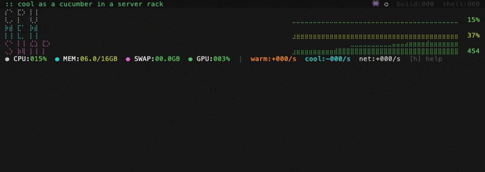

# coolant

A resource management layer for Claude Code -- prevents machines from melting when parallel agents run unthrottled.



## What it does

The thermal dashboard is a real-time system monitor built for Claude Code. It renders CPU, MEM, and SWAP as double-resolution braille sparklines with severity coloring that shifts from green through yellow to red as pressure builds. Session diamonds on the headline bar encode the language-build-shell escalation dance -- each Claude Code session's diamond changes color as it progresses through compilation phases (gray idle, green active, yellow language/compile, orange build tools, red shell explosion). Breathing space invader icons show active subagents at a glance.

Under the hood, coolant's hook system prevents resource exhaustion without any manual intervention. A gate hook caps concurrent test runners based on active agent count and suppresses build tools during parallel mode. Agent lifecycle hooks track spawn and death counts via structured JSONL events. The hooks run without external dependencies -- just bash 3.2 and macOS system APIs. The dashboard needs Go and Xcode Command Line Tools to build.

## Quick start

```bash
# Clone and build the dashboard
git clone https://github.com/toddwshaffer/coolant.git
cd coolant/thermal
go build -o ../bin/thermal ./cmd/thermal/

# See it in action (synthetic demo data)
../bin/thermal --demo

# Or monitor your real system
../bin/thermal
```

Then install as a Claude Code plugin:

```bash
# Run Claude Code with coolant loaded
claude --plugin-dir /path/to/coolant

# Or install permanently (when supported)
# claude plugin install coolant
```

## The dashboard

A single bottom-strip panel designed for a tmux split alongside your Claude Code session. Glance down, know the state.

- **Am I about to lock up?** -- CPU, MEM, and SWAP sparklines with severity coloring. Green is fine, yellow means watch it, red means act now.
- **Which session is the problem?** -- Each diamond is a Claude Code session. Color tracks the compilation dance: idle (gray), language spinning up (yellow), build tools running (orange), shell explosion (red, 30+ processes).
- **How many agents are running?** -- Breathing hexagons on the headline, one per active subagent. Pulsing means alive.
- **What's eating resources?** -- Live process counts by category (`build:003 shell:087`). Runtime labels (`node`, `go`, `rust`) appear when those processes are active and disappear when they're not.
- **System vitals** -- CPU/MEM/SWAP/GPU gauges, spawn/death rates, network connectivity.

Keyboard shortcuts: `h` help overlay, `q` quit.

## Hooks

| Hook | Script | What it does |
|------|--------|--------------|
| SessionStart | `preflight.sh` | Warns about missing worktree exclusions |
| PreToolUse | `gate.sh` | Caps test runners by agent count, suppresses build tools in parallel mode |
| SubagentStart | `agent-start.sh` | Increments agent counter, emits JSONL event |
| SubagentStop | `agent-stop.sh` | Decrements counter, auto-disengages parallel mode when agents finish |

The gate applies adaptive concurrency: `cap = floor((cores - 2) / agents)`, minimum 1. One agent gets generous parallelism; five agents each get a fair share. Test runners (vitest, jest, cargo test, go test, pytest) are always capped. Build tools, type checkers, and linters (tsc, eslint, cargo build, go vet, mypy, etc.) are suppressed entirely during parallel mode. Commands are matched regardless of wrappers (`npx tsc`, `env vitest`) or path prefixes.

## Skills

`/coolant:parallel` -- Toggle parallel mode to suppress per-edit typecheck hooks. Commands: `on`, `off`, `status`.

## Requirements

- **macOS** -- the dashboard uses cgo + mach `host_statistics` for CPU ticks, `vm_stat` for memory, `sysctl` for swap
- **Xcode Command Line Tools** -- required for cgo (`xcode-select --install`)
- **Go 1.25+** -- to build the thermal dashboard (`brew install go`)
- **bash 3.2+** -- hooks only, ships with macOS
- **tmux** -- optional, for running the dashboard in a bottom split pane

Hooks work on any platform with bash. The thermal dashboard is macOS-only due to native system API usage.

## Project structure

```
hooks/          # bash hook definitions
scripts/        # hook implementations + shared config
thermal/        # Go thermal dashboard (bubbletea)
skills/         # /coolant:parallel skill
tests/          # bats test suite
```

## License

MIT
